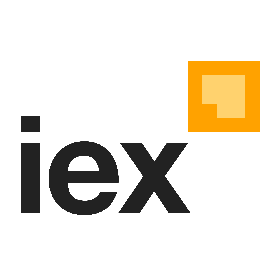

# 

Perspective is an <i>interactive</i> visualization component for <i>large</i>, <i>real-time</i>
datasets. Originally developed for J.P. Morgan's trading business,  Perspective
makes it simple to build user-configurable analytics entirely in the
browser, or in concert with Python and/or
[JupyterLab](https://jupyterlab.readthedocs.io/en/stable/).
Use it to create reports, dashboards, notebooks and applications, with static
data or streaming updates via [Apache Arrow](https://arrow.apache.org/).

## Features

- A fast, memory efficient streaming query engine, written in C++ and compiled for both [WebAssembly](https://webassembly.org/) and [Python](https://www.python.org/), with read/write/stream/virtual support for [Apache Arrow](https://arrow.apache.org/).

- A framework-agnostic User Interface component and [Jupyterlab](https://jupyterlab.readthedocs.io/en/stable/) Widget, over WebWorker (WebAssembly) or WebSocket (Python/Node), and a suite of Datagrid and [D3FC](https://d3fc.io/) Chart plugins.
`
## Examples
||||
|:--|:--|:--|
|Superstore|Olympics|Custom Styles|
||||
|Editable|Streaming|CSV|
||||
|IEX Cloud|NYC Citibike|JupyterLab Plugin|
||||

## Documentation

* [Project Site](https://perspective.finos.org/)
* [Table](https://perspective.finos.org/docs/md/table.html)
* [View](https://perspective.finos.org/docs/md/view.html)
* [Javascript User Guide](https://perspective.finos.org/docs/md/js.html)
* [Python User Guide](https://perspective.finos.org/docs/md/python.html)
* [Data Binding](https://perspective.finos.org/docs/md/table.html)
* [Developer Guide](https://perspective.finos.org/docs/md/development.html)
* [Perspective API](https://github.com/finos/perspective/blob/master/packages/perspective/README.md)
* [Perspective Viewer API](https://github.com/finos/perspective/blob/master/packages/perspective-viewer/README.md)
* [Perspective Python API](https://perspective.finos.org/docs/obj/perspective-python.html)

## Community

The following organizations support and/or use perspective.

| | | | |
|:--:|:--:|:--:|:--:|
|</img>|</img>|</img>|</img>|
| [J.P. Morgan](https://www.jpmorgan.com/) | [Scott Logic](https://www.scottlogic.com/) | [RBC Capital Markets](https://www.rbc.com/) | [IEX](https://iextrading.com/) |