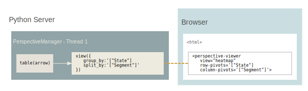

# Client/Server replicated



_For medium-sized, real-time, synchronized and/or editable data sets with many
concurrent users._

The dataset is instantiated in-memory with a Python or Node.js Perspective
server, and web applications create duplicates of these tables in a local
WebAssembly client in the browser, synchonized efficiently to the server via
Apache Arrow. This design scales well with additional concurrent users, as
browsers only need to download the initial data set and subsequent update
deltas, while operations like scrolling, pivots, sorting, etc. are performed on
the client.

Python servers can make especially good use of additional threads, as
Perspective will release the GIL for almost all operations. Interactive
performance on the client is very good and identical to client-only
architecture. Updates and edits are seamlessly synchonized across clients via
their virtual server counterparts using websockets and Apache Arrow.

#### Python and Tornado server

```python
from perspective import Server, PerspectiveTornadoHandler

server = Server()
client = server.new_local_client()
client.table(csv, name="my_table")
routes = [(
    r"/websocket",
    perspective.handlers.tornado.PerspectiveTornadoHandler,
    {"perspective_server": server},
)]

app = tornado.web.Application(routes)
app.listen(8080)
loop = tornado.ioloop.IOLoop.current()
loop.start()
```

#### Javascript client

Perspective's websocket client interfaces with the Python server. then
_replicates_ the server-side Table.

```javascript
const websocket = await perspective.websocket("ws://localhost:8080");
const server_table = await websocket.open_table("my_table");
const server_view = await server_table.view();

const worker = await perspective.worker();
const client_table = await worker.table(server_view);

const viewer = document.createElement("perspective-viewer");
document.body.appendChild(viewer);
await viewer.load(client_table);
```
