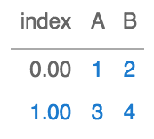
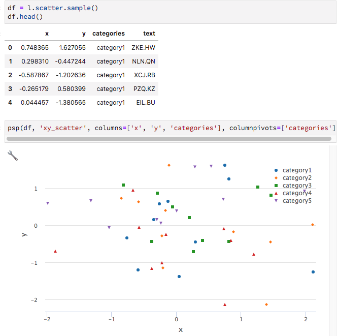

===============
Getting started
===============

Overview
===============
If you've successfully installed both perspective-python, and the perspective JupyterLab extension, its time to get plotting.

.. code:: python3

    import pandas as pd
    from perspective import psp
    df = pd.DataFrame([{'A':1, 'B':2}, {'A':3, 'B':4}])
    psp(df)

The `psp` function
==================
.. function:: def psp(data, view='hypergrid', columns=None, rowpivots=None, columnpivots=None, aggregates=None, settings=False):

    '''Render a perspective javascript widget in jupyter

    :param data: data {dataframe or live source} -- The static or live datasource
    :type data: dataframe

    :param view: what view to use. available in the enum View. default: hypergrid
    :type view: str/View
     
    :param columns: what columns to display
    :type columns: list of strings
    :param rowpivots: what names to use as rowpivots
    :type rowpivots: list of strings
    :param columnpivots: what names to use as columnpivots
    :type columnpivots: list of strings
    :param aggregates: dictionary of name to aggregate type (either string or enum Aggregate)
    :type aggregates: dict(str, str or Aggregate)
    :param settings: display settings
    :type settings: boolean
    :rtype: IPython.display object

Example:

