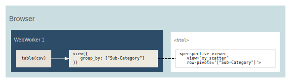

<style>{"svg{width:100%;height:100%"}</style>

This crate contains the server/engine components of the
[Perspective](https://perspective.finos.org) data visualization suite. It is
meant to be used in conjunction with the other crates of this project, e.g.
`perspective-client` to create client connections to a server.

The [`perspective`] crate provides a convenient frontend for Rust developers,
including both [`perspective_client`] and [`perspective_server`] as well as
other convenient integration helpers.

# Data Binding Options


Application developers can choose from [Client (WebAssembly)](#client-only),
[Server (Python/Node)](#server-only) or
[Client/Server Replicated](#clientserver-replicated) designs to bind data, and a
web application can use one or a mix of these designs as needed. By serializing
to Apache Arrow, tables are duplicated and synchronized across runtimes
efficiently.

Perspective is a multi-language platform. The examples in this section use
Python and JavaScript as an example, but the same general principles apply to
any `Client`/`Server` combination.

## Client-only



_For static datasets, datasets provided by the user, and simple server-less and
read-only web applications._

In this design, Perspective is run as a client Browser WebAssembly library, the
dataset is downloaded entirely to the client and all calculations and UI
interactions are performed locally. Interactive performance is very good, using
WebAssembly engine for near-native runtime plus WebWorker isolation for parallel
rendering within the browser. Operations like scrolling and creating new views
are responsive. However, the entire dataset must be downloaded to the client.
Perspective is not a typical browser component, and datset sizes of 1gb+ in
Apache Arrow format will load fine with good interactive performance!

Horizontal scaling is a non-issue, since here is no concurrent state to scale,
and only uses client-side computation via WebAssembly client. Client-only
perspective can support as many concurrent users as can download the web
application itself. Once the data is loaded, no server connection is needed and
all operations occur in the client browser, imparting no additional runtime cost
on the server beyond initial load. This also means updates and edits are local
to the browser client and will be lost when the page is refreshed, unless
otherwise persisted by your application.

As the client-only design starts with creating a client-side Perspective
`Table`, data can be provided by any standard web service in any Perspective
compatible format (JSON, CSV or Apache Arrow).

#### Javascript client

```javascript
const worker = await perspective.worker();
const table = await worker.table(csv);

const viewer = document.createElement("perspective-viewer");
document.body.appendChild(viewer);
await viewer.load(table);
```

## Client/Server Replicated


_For medium-sized, real-time, synchronized and/or editable data sets with many
concurrent users._

The dataset is instantiated in-memory with a Python or Node.js Perspective
server, and web applications create duplicates of these tables in a local
WebAssembly client in the browser, synchonized efficiently to the server via
Apache Arrow. This design scales well with additional concurrent users, as
browsers only need to download the initial data set and subsequent update
deltas, while operations like scrolling, pivots, sorting, etc. are performed on
the client.

Python servers can make especially good use of additional threads, as
Perspective will release the GIL for almost all operations. Interactive
performance on the client is very good and identical to client-only
architecture. Updates and edits are seamlessly synchonized across clients via
their virtual server counterparts using websockets and Apache Arrow.

#### Python and Tornado server

```python
from perspective import Server, PerspectiveTornadoHandler

server = Server()
client = server.new_local_client()
client.table(csv, name="my_table")
routes = [(
    r"/websocket",
    perspective.handlers.tornado.PerspectiveTornadoHandler,
    {"perspective_server": server},
)]

app = tornado.web.Application(routes)
app.listen(8080)
loop = tornado.ioloop.IOLoop.current()
loop.start()
```

#### Javascript client

Perspective's websocket client interfaces with the Python server. then
_replicates_ the server-side Table.

```javascript
const websocket = await perspective.websocket("ws://localhost:8080");
const server_table = await websocket.open_table("my_table");
const server_view = await server_table.view();

const worker = await perspective.worker();
const client_table = await worker.table(server_view);

const viewer = document.createElement("perspective-viewer");
document.body.appendChild(viewer);
await viewer.load(client_table);
```

## Server-only


_For extremely large datasets with a small number of concurrent users._

The dataset is instantiated in-memory with a Python or Node.js server, and web
applications connect virtually. Has very good initial load performance, since no
data is downloaded. Group-by and other operations will run column-parallel if
configured.

But interactive performance is poor, as every user interaction must page the
server to render. Operations like scrolling are not as responsive and can be
impacted by network latency. Web applications must be "always connected" to the
server via WebSocket. Disconnecting will prevent any interaction, scrolling,
etc. of the UI. Does not use WebAssembly.

Each connected browser will impact server performance as long as the connection
is open, which in turn impacts interactive performance of every client. This
ultimately limits the horizontal scalabity of this architecture. Since each
client reads the perspective `Table` virtually, changes like edits and updates
are automatically reflected to all clients and persist across browser refresh.
Using the same Python server as the previous design, we can simply skip the
intermediate WebAssembly `Table` and pass the virtual table directly to `load()`

```javascript
const websocket = await perspective.websocket("ws://localhost:8080");
const server_table = await websocket.open_table("my_table");

const viewer = document.createElement("perspective-viewer");
document.body.appendChild(viewer);
await viewer.load(server_table);
```

# Feature Flags

The following feature flags are available to enable in your `Cargo.toml`:

-   `external-cpp` Set this flag to configure this crate's compile process to
    look for Perspective C++ source code in the environment rather than locally,
    e.g. for when you build this crate in-place in the Perspective repo source
    tree.
